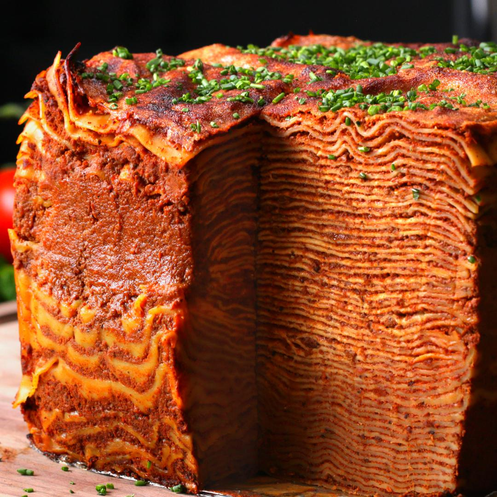

# Neovim Config

This is how you stack lasagna:

## Navigating this Repo

This is my Neovim config, mostly powered by [lazy.nvim](https://github.com/folke/lazy.nvim).

The following files run the show:

- [init](lua/config/init.lua)
- [settings](lua/config/settings.lua)
- [autocmds](lua/config/autocmds.lua)
- [keymaps](lua/config/keymaps.lua)

Most `plugin-specific-keymaps` are instantiated in their respective plugin files, located
in the following directory:

- [plugins/](./lua/plugins)

## Plugins used in this config

This config makes use of the following plugins. Configuration for these plugins can be
found in [lua/plugins/](./lua/plugins).

- [JoosepAlviste/nvim-ts-context-commentstring](https://github.com/JoosepAlviste/nvim-ts-context-commentstring)
- [L3MON4D3/LuaSnip](https://github.com/L3MON4D3/LuaSnip)
- [MunifTanjim/nui.nvim](https://github.com/MunifTanjim/nui.nvim)
- [NoahTheDuke/vim-just](https://github.com/NoahTheDuke/vim-just)
- [ThePrimeagen/harpoon](https://github.com/ThePrimeagen/harpoon/tree/harpoon2)
- [Wansmer/treesj](https://github.com/Wansmer/treesj)
- [akinsho/toggleterm.nvim](https://github.com/akinsho/toggleterm.nvim)
- [alexghergh/nvim-tmux-navigation](https://github.com/alexghergh/nvim-tmux-navigation)
- [antoinemadec/FixCursorHold.nvim](https://github.com/antoinemadec/FixCursorHold.nvim)
- [axieax/urlview.nvim](https://github.com/axieax/urlview.nvim)
- [barrett-ruth/telescope-http.nvim](https://github.com/barrett-ruth/telescope-http.nvim)
- [catppuccin/nvim](https://github.com/catppuccin/nvim)
- [davvid/telescope-git-grep.nvim](https://github.com/davvid/telescope-git-grep.nvim)
- [elfahor/telescope-just](https://codeberg.org/elfahor/telescope-just.nvim)
- [f-person/git-blame.nvim](https://github.com/f-person/git-blame.nvim)
- [folke/flash.nvim](https://github.com/folke/flash.nvim)
- [folke/neodev.nvim](https://github.com/folke/neodev.nvim)
- [folke/tokyonight.nvim](https://github.com/folke/tokyonight.nvim)
- [folke/trouble.nvim](https://github.com/folke/trouble.nvim)
- [folke/twilight.nvim](https://github.com/folke/twilight.nvim)
- [folke/which-key.nvim](https://github.com/folke/which-key.nvim)
- [folke/zen-mode.nvim](https://github.com/folke/zen-mode.nvim)
- [hrsh7th/cmp-buffer](https://github.com/hrsh7th/cmp-buffer)
- [hrsh7th/cmp-calc](https://github.com/hrsh7th/cmp-calc)
- [hrsh7th/cmp-cmdline](https://github.com/hrsh7th/cmp-cmdline)
- [hrsh7th/cmp-nvim-lsp](https://github.com/hrsh7th/cmp-nvim-lsp)
- [hrsh7th/cmp-path](https://github.com/hrsh7th/cmp-path)
- [hrsh7th/nvim-cmp](https://github.com/hrsh7th/nvim-cmp)
- [iamcco/markdown-preview.nvim](https://github.com/iamcco/markdown-preview.nvim)
- [j-hui/fidget.nvim](https://github.com/j-hui/fidget.nvim)
- [junegunn/fzf](https://github.com/junegunn/fzf)
- [jvgrootveld/telescope-zoxide](https://github.com/jvgrootveld/telescope-zoxide)
- [kana/vim-textobj-datetime](https://github.com/kana/vim-textobj-datetime)
- [kana/vim-textobj-entire](https://github.com/kana/vim-textobj-entire)
- [kana/vim-textobj-user](https://github.com/kana/vim-textobj-user)
- [kevinhwang91/nvim-bqf](https://github.com/kevinhwang91/nvim-bqf)
- [kylechui/nvim-surround](https://github.com/kylechui/nvim-surround)
- [lewis6991/gitsigns.nvim](https://github.com/lewis6991/gitsigns.nvim)
- [linux-cultist/venv-selector.nvim](https://github.com/linux-cultist/venv-selector.nvim)
- [lukas-reineke/cmp-rg](https://github.com/lukas-reineke/cmp-rg)
- [marilari88/neotest-vitest](https://github.com/marilari88/neotest-vitest)
- [mattn/vim-textobj-url](https://github.com/mattn/vim-textobj-url)
- [mbbill/undotree](https://github.com/mbbill/undotree)
- [nanotee/zoxide.vim](https://github.com/nanotee/zoxide.vim)
- [nat-418/boole.nvim](https://github.com/nat-418/boole.nvim)
- [neovim/nvim-lspconfig](https://github.com/neovim/nvim-lspconfig)
- [nkakouros-original/numbers.nvim](https://github.com/nkakouros-original/numbers.nvim)
- [numToStr/Comment.nvim](https://github.com/numToStr/Comment.nvim)
- [nvim-lua/plenary.nvim](https://github.com/nvim-lua/plenary.nvim)
- [nvim-lua/popup.nvim](https://github.com/nvim-lua/popup.nvim)
- [nvim-lualine/lualine.nvim](https://github.com/nvim-lualine/lualine.nvim)
- [nvim-neo-tree/neo-tree.nvim](https://github.com/nvim-neo-tree/neo-tree.nvim)
- [nvim-neotest/neotest-plenary](https://github.com/nvim-neotest/neotest-plenary)
- [nvim-neotest/neotest](https://github.com/nvim-neotest/neotest)
- [nvim-telescope/telescope-file-browser.nvim](https://github.com/nvim-telescope/telescope-file-browser.nvim)
- [nvim-telescope/telescope-fzf-native.nvim](https://github.com/nvim-telescope/telescope-fzf-native.nvim)
- [nvim-telescope/telescope-github.nvim](https://github.com/nvim-telescope/telescope-github.nvim)
- [nvim-telescope/telescope-media-files.nvim](https://github.com/nvim-telescope/telescope-media-files.nvim)
- [nvim-telescope/telescope-project.nvim](https://github.com/nvim-telescope/telescope-project.nvim)
- [nvim-telescope/telescope.nvim](https://github.com/nvim-telescope/telescope.nvim)
- [nvim-tree/nvim-web-devicons](https://github.com/nvim-tree/nvim-web-devicons)
- [nvim-treesitter/nvim-treesitter-textobjects](https://github.com/nvim-treesitter/nvim-treesitter-textobjects)
- [nvim-treesitter/nvim-treesitter](https://github.com/nvim-treesitter/nvim-treesitter)
- [okuuva/auto-save.nvim](https://github.com/okuuva/auto-save.nvim)
- [pearofducks/ansible-vim](https://github.com/pearofducks/ansible-vim)
- [petertriho/cmp-git](https://github.com/petertriho/cmp-git)
- [rcarriga/nvim-notify](https://github.com/rcarriga/nvim-notify)
- [rest-nvim/rest.nvim](https://github.com/rest-nvim/rest.nvim)
- [rhysd/git-messenger.vim](https://github.com/rhysd/git-messenger.vim)
- [saadparwaiz1/cmp_luasnip](https://github.com/saadparwaiz1/cmp_luasnip)
- [saifulapm/chartoggle.nvim](https://github.com/saifulapm/chartoggle.nvim)
- [sgur/vim-textobj-parameter](https://github.com/sgur/vim-textobj-parameter)
- [stevearc/aerial.nvim](https://github.com/stevearc/aerial.nvim)
- [stevearc/conform.nvim](https://github.com/stevearc/conform.nvim)
- [stevearc/dressing.nvim](https://github.com/stevearc/dressing.nvim)
- [stevearc/oil.nvim](https://github.com/stevearc/oil.nvim)
- [stevearc/overseer.nvim](https://github.com/stevearc/overseer.nvim)
- [thinca/vim-textobj-between](https://github.com/thinca/vim-textobj-between)
- [tpope/vim-eunuch](https://github.com/tpope/vim-eunuch)
- [tpope/vim-fugitive](https://github.com/tpope/vim-fugitive)
- [tpope/vim-rhubarb](https://github.com/tpope/vim-rhubarb)
- [tpope/vim-sleuth](https://github.com/tpope/vim-sleuth)
- [tpope/vim-unimpaired](https://github.com/tpope/vim-unimpaired)
- [vimtaku/vim-textobj-keyvalue](https://github.com/vimtaku/vim-textobj-keyvalue)
- [webdavis/vim-rsi](https://github.com/webdavis/vim-rsi) - `fork` that removes some conflicting keymaps
- [webdavis/vim-textobj-comment](https://github.com/webdavis/vim-textobj-comment) - `fork` that remaps conflicting keymaps
- [webdavis/vim-textobj-line](https://github.com/webdavis/vim-textobj-line) - `fork` that remaps conflicting keymaps
- [wellle/targets.vim](https://github.com/wellle/targets.vim)
- [williamboman/mason-lspconfig.nvim](https://github.com/williamboman/mason-lspconfig.nvim)
- [williamboman/mason.nvim](https://github.com/williamboman/mason.nvim)
- [windwp/nvim-autopairs](https://github.com/windwp/nvim-autopairs)
- [wojciech-kulik/xcodebuild.nvim](https://github.com/wojciech-kulik/xcodebuild.nvim)

> [!NOTE]
> Some of the plugins listed here are *just dependencies* for other plugins in this list.

